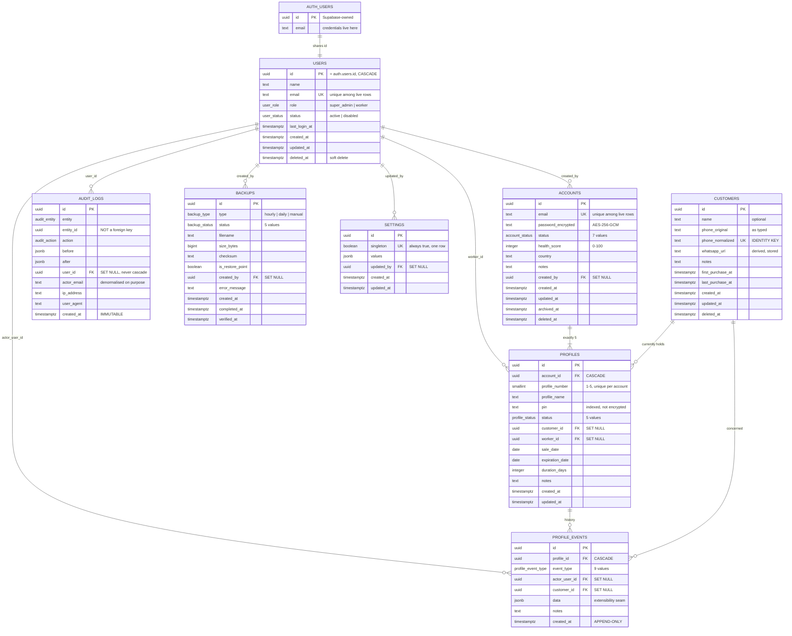

# Entity Relationship Diagram

Version: 1.0
Milestone: M02
Generated: 2026-08-08

---

## Mermaid



---

## ASCII

```
                        ┌──────────────────────┐
                        │  auth.users          │  Supabase-owned.
                        │  (credentials)       │  Never in our migrations.
                        └──────────┬───────────┘
                                   │ 1:1, shared id, CASCADE
                        ┌──────────▼───────────┐
                        │  users               │
                        │  role · status       │  ◄── authoritative role
                        └──────────┬───────────┘
                                   │
        ┌───────────┬──────────────┼──────────────┬───────────┐
        │           │              │              │           │
   created_by   worker_id     actor_user_id    user_id    created_by
        │           │              │              │           │
        ▼           ▼              ▼              ▼           ▼
┌───────────────┐   │      ┌──────────────┐ ┌──────────┐ ┌─────────┐
│  accounts     │   │      │profile_events│ │audit_logs│ │ backups │
│  status       │   │      │  APPEND-ONLY │ │ IMMUTABLE│ │         │
│  health 0-100 │   │      └──────▲───────┘ └──────────┘ └─────────┘
│  pw encrypted │   │             │
└───────┬───────┘   │             │ CASCADE
        │           │             │
        │ 1:5 CASCADE             │
        │           │             │
        ▼           ▼             │
┌────────────────────────────┐    │
│  profiles                  │────┘
│  number 1-5, unique/acct   │
│  status · pin · dates      │
└───────────▲────────────────┘
            │ SET NULL
            │
┌───────────┴────────────────┐        ┌──────────────┐
│  customers                 │        │  settings    │
│  phone_normalized = IDENTITY│       │  one row only│
└────────────────────────────┘        └──────────────┘
```

---

## Cardinality

| Relationship | Cardinality | Delete |
| ------------ | ----------- | ------ |
| auth.users → users | 1 : 1 | CASCADE |
| accounts → profiles | 1 : **exactly 5** | CASCADE |
| profiles → profile_events | 1 : N | CASCADE |
| customers → profiles | 1 : N (currently held) | SET NULL |
| customers → profile_events | 1 : N | SET NULL |
| users → accounts | 1 : N (creator) | SET NULL |
| users → profiles | 1 : N (worker) | SET NULL |
| users → audit_logs | 1 : N | SET NULL |
| users → backups | 1 : N | SET NULL |
| users → settings | 1 : N (updater) | SET NULL |

The `1 : exactly 5` is the only fixed cardinality in the schema. The database
guarantees "no more than 5"; `accountsRepository.create` guarantees "no fewer",
by writing all six rows in one transaction.

---

## Deferred entities

Not created in M02 (ADR-005 Decision 1). Shown so the intended shape is not lost:

```
orders            profiles ──1:N──► orders ◄──1:N── customers
                  users ──1:N──► orders
                  Would restore profiles.current_order_id.

issues            accounts ──1:N──► issues
                  "Issues belong to Accounts. Never Profiles." (03_DATABASE.md)

timeline_events   accounts ──1:N──► timeline_events
                  Account-grain history. Required by 01_MASTER_RULES.md
                  and still OUTSTANDING.

notifications     users ──1:N──► notifications
```

---

## Reading the diagram

- **`||--|{`** — one to many, at least one (accounts → profiles)
- **`||--o{`** — one to many, optionally zero
- **`||--||`** — one to one
- **UK** — unique. All uniques except `settings.singleton` and
  `(account_id, profile_number)` are **partial**, excluding soft-deleted rows.
- **PK** — primary key. All are uuid; only `users.id` is not generated, because
  it comes from Supabase Auth.
